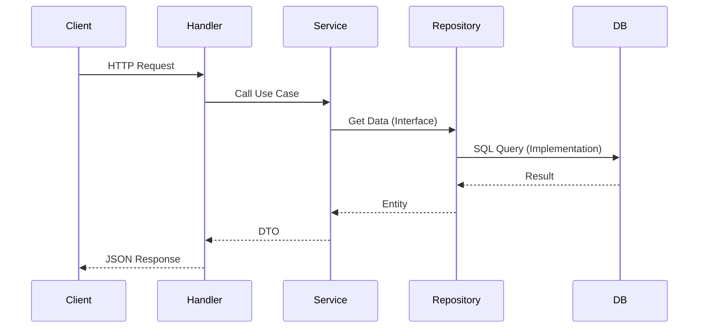

# Backend Architecture

The backend is a **Modular Monolith** using **idiomatic Go project layout** (Standard Layout 2026).

## High-Level Structure

```
go-b2b-starter/
├── cmd/                  # Application entry points
│   └── api/
│       └── main.go       # Main entry point
│
├── internal/             # Private application code (import boundary)
│   ├── bootstrap/        # Application initialization
│   ├── api/              # Route registration
│   │
│   ├── auth/             # Authentication & RBAC module
│   ├── billing/          # Subscription & billing module
│   ├── organizations/    # Multi-tenant organizations
│   ├── documents/        # Document management
│   ├── cognitive/        # AI/RAG features
│   │
│   ├── db/               # Database layer (SQLC)
│   ├── server/           # HTTP server & middleware
│   ├── redis/            # Redis client
│   └── stytch/           # Auth provider adapter
│
├── pkg/                  # Public reusable packages
│   ├── httperr/          # HTTP error types
│   ├── pagination/       # Pagination helpers
│   └── response/         # API response utilities
│
└── go.mod                # Single consolidated module
```

## Module Structure (Clean Architecture)

Each feature module in `internal/` follows **Clean Architecture**:

```
internal/billing/
├── cmd/                  # Module initialization (DI wiring)
│   └── init.go
│
├── app/                  # Application Layer (Use Cases)
│   └── services/
│       └── billing_service.go
│
├── domain/               # Domain Layer (Core Business Logic)
│   ├── entities.go       # Data structures
│   └── repository.go     # Interface definitions
│
├── infra/                # Infrastructure Layer (External)
│   └── repositories/
│       └── postgres_repository.go
│
├── handler.go            # HTTP handlers (Delivery Layer)
├── routes.go             # Route registration
└── provider.go           # Dependency injection setup
```

## Key Principles

1. **`internal/` Boundary**: Code in `internal/` cannot be imported by external packages. This enforces encapsulation.

2. **Dependency Rule**: Inner layers (Domain) rely on nothing. Outer layers (Infra) depend on inner layers via interfaces.

3. **Feature-Based Organization**: Modules are organized by feature (billing, auth, organizations), not by layer (controllers, services, models).

4. **Single `go.mod`**: One module for the entire project eliminates workspace complexity.

## Request Flow



## Initialization Flow

```
cmd/api/main.go
    └── bootstrap.Execute()
        └── InitMods(container)
            ├── server.SetupDependencies()
            ├── db.Init()
            ├── redis.Init()
            ├── auth.Init()
            ├── organizations.Init()
            ├── billing.Init()
            └── api.Init()  # Register routes
```
